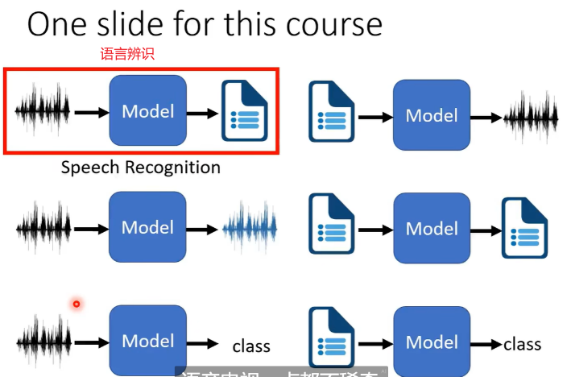
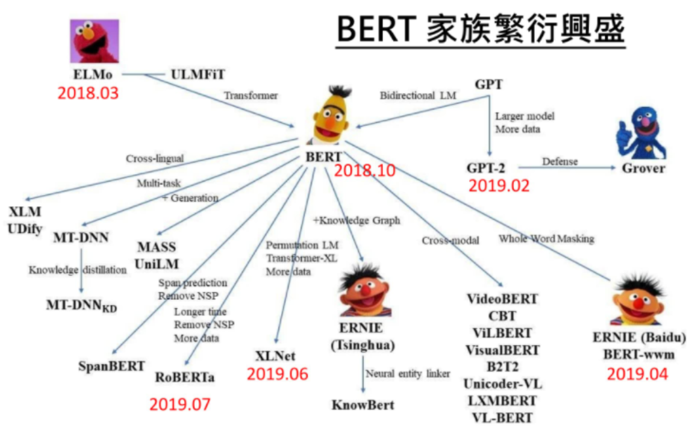
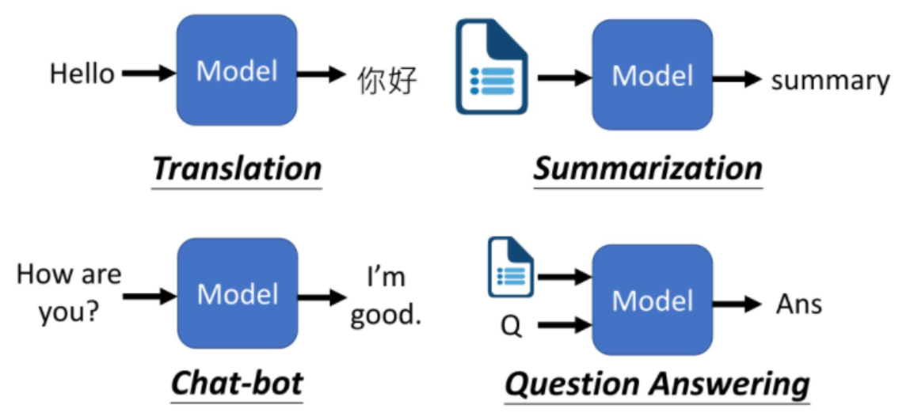

# 01 李宏毅自然语言处理课程

课程链接 ：

https://www.bilibili.com/video/BV17T411w7FH/?spm_id_from=333.788.recommend_more_video.14&vd_source=fab4cd66aafcb3b54c4bc627c1dcaac1

# 1. 六个模型

1. 语言辨识（Automatic Speech Recognition(ASR)）： https://ai.googleblog.com/2019/03/an-all-neural-on-device-speech.html
2. 语言合成（Text-to-Speech Synthesis(TTS)）

​		Keiichi Tokuda，keynote，INTERSPEECH’19 （语言领域的 top conference ）

3. 语言分离（Speech Separation）
4. 语言转换（Voice conversion），类似于 image style transfer 
5. keyword study：唤醒词

# 2. Bert

参数：ELMO(94M)、BERT(340M)、GPT-2(1542M)

文本生成中：

​	

各种任务：

# 3. Meta Learning

Learn to learn

# 4. Adversarial Attack 

对抗攻击

