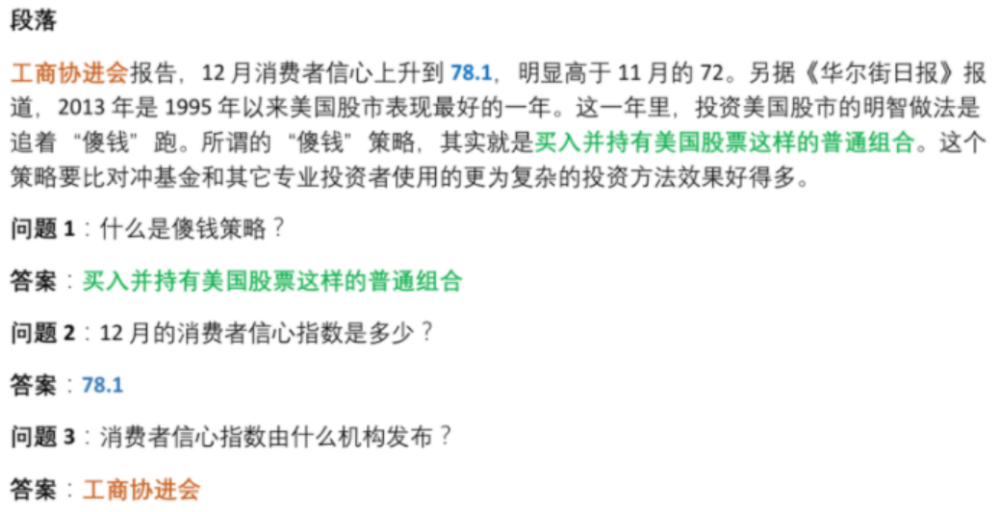
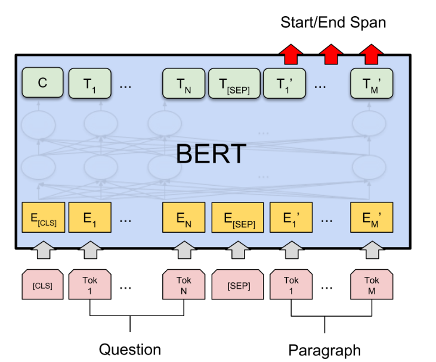
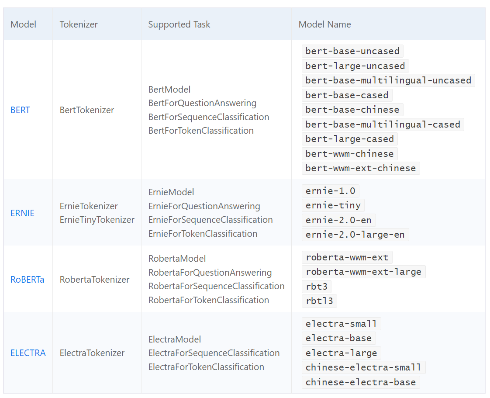

# 作业4-机器阅读理解（QA）

https://aistudio.baidu.com/aistudio/projectdetail/5135488

# 1 项目描述

阅读理解是自然语言处理中的一个重要的任务，最常见的数据集是单篇章、抽取式阅读理解数据集。

具体的任务定义为：对于一个给定的问题q和一个篇章p，根据篇章内容，给出该问题的答案a。数据集中的每个样本，是一个三元组<q, p, a>，例如：

问题 q: 乔丹打了多少个赛季

篇章 p: 迈克尔.乔丹在NBA打了15个赛季。他在84年进入nba，期间在1993年10月6日第一次退役改打棒球，95年3月18日重新回归，在99年1月13日第二次退役，后于2001年10月31日复出，在03年最终退役…

参考答案 a: [‘15个’,‘15个赛季’]

**阅读理解本质是一个答案抽取任务，PaddleNLP对于各种预训练模型已经内置了对于下游任务-答案抽取的Fine-tune网络**。

以下项目以BERT为例，介绍如何将预训练模型Fine-tune完成答案抽取任务。

<u>答案抽取任务的本质就是根据输入的问题和文章，预测答案在文章中的起始位置和结束位置。</u>基于BERT的答案抽取原理如下图所示：

模型训练的过程通常有以下步骤：

1. 从dataloader中取出一个batch data
2. 将batch data喂给model，做前向计算
3. 将前向计算结果传给损失函数，计算loss。
4. loss反向回传，更新梯度。重复以上步骤。

每训练一个epoch时，**程序通过evaluate()调用paddlenlp.metric.squad中的squad_evaluate(), compute_predictions()评估当前模型训练的效果，其中：**

- **compute_predictions()用于生成可提交的答案；**
- **squad_evaluate()用于返回评价指标。**

二者适用于所有符合squad数据格式的答案抽取任务。这类任务使用F1和exact match来评估预测的答案和真实答案的相似程度。

### 数据集加载

PaddleNLP已经内置SQuAD，CMRC等中英文阅读理解数据集，一键即可加载。本数据集采用SQuAD数据格式，这些数据处理操作会在数据集加载时完成。详情可见dataset.py中定义的DataMRC类。

- 训练集：约1500条
- 验证集：约400条
- 测试集：约400条

# 2 项目要求

1. 请在终端里跑通Baseline （./work/train.sh）
2. 请分别挑出一些预测正确和预测不正确的样本，并截图
3. 哪些参数可以调整以达到更好的模型表现？为什么？（例如，<u>学习率、batch size、warmup_steps、layer_norm_eps</u>等等）
4. 尝试<u>更换不同的预训练模型（权重）</u>来提高分数

# 3 更多的预训练模型

PaddleNLP不仅支持**BERT**预训练模型，还支持ERNIE、RoBERTa、Electra等预训练模型。 下表汇总了目前PaddleNLP支持的各类预训练模型。用户可以使用PaddleNLP提供的模型，完成问答、序列分类、token分类等任务。同时我们提供了22种预训练的参数权重供用户使用，其中包含了**11种中文语言模型**的预训练权重。

注：其中中文的预训练模型有 `bert-base-chinese, bert-wwm-chinese, bert-wwm-ext-chinese, ernie-1.0, ernie-tiny, roberta-wwm-ext, roberta-wwm-ext-large, rbt3, rbtl3, chinese-electra-base, chinese-electra-small` 等。

