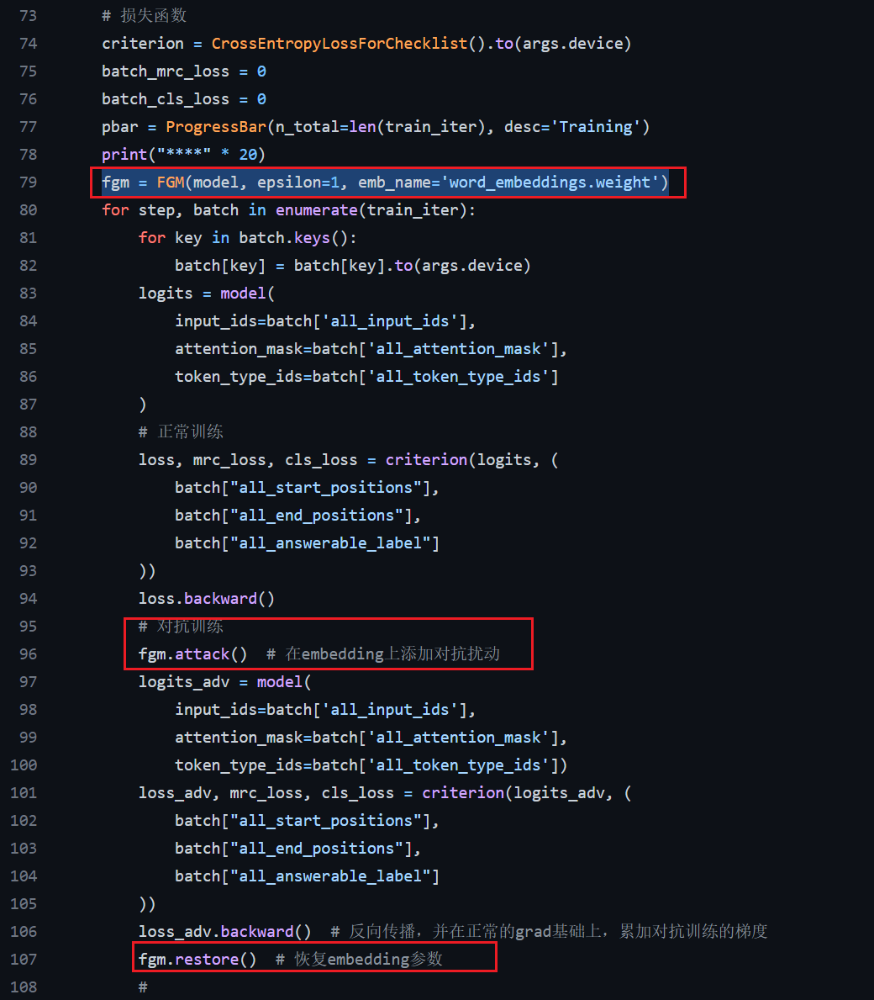

# 百度 2021 Lic 机器阅读理解比赛

http://t.csdn.cn/JUurW

代码地址：https://github.com/zhoujx4/DuReader-Checklist-BASELINE

​	Bert模型

1. 基于paddlepaddle框架的,我把它改写成了Pytorch框架
2. 增加了早停策略/对抗训练

# 优化策略

数据清洗： https://zhuanlan.zhihu.com/p/517220095

数据增强：https://zhuanlan.zhihu.com/p/145521255

